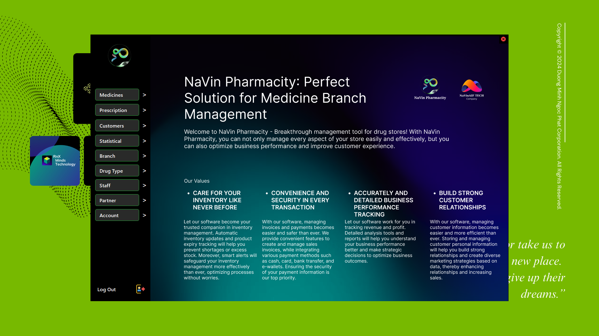

# Official NaVin Pharmacity - Copyright NaVin Management © NaVin AIF Technology. All Rights Reserved
"Tính năng quản lý thuốc của NaVin Pharmacity giúp nhà thuốc kiểm soát chặt chẽ tồn kho, giảm thiểu tình trạng hết hàng hoặc quá hạn sử dụng. Hệ thống tự động cập nhật số lượng thuốc khi nhập hàng hoặc xuất hàng, đồng thời gửi thông báo khi thuốc sắp hết hạn hoặc số lượng tồn kho thấp. Nhờ đó, nhà thuốc luôn đảm bảo cung cấp cho khách hàng những sản phẩm chất lượng và an toàn."

## Hướng dẫn setup, tiền chuẩn bị trước khi khởi chạy hệ thống
* Đầu tiên, quý khách hàng cần download thư mục source NaVin Pharmacity được cung cấp bởi NaVin Tech, quý khách hàng có thể download từ link Google Drive hoặc Github do công ty cung cấp hoặc liên hệ Bộ Phận Dịch Vụ Hỗ Trợ từ chúng tôi để nhận được hỗ trợ.
* Thực hiện giải nén file dự án
* Để chạy dự án trên thiết bị , máy tính vật lý, cần cài đặt file navinsetup.exe để thực hiện setup và cài đặt hệ thống, khuyến khích hệ điều hành Windows 10 & 11 64-bit để có thể sử dụng và khởi chạy một cách thuận lợi và được hỗ trợ mạnh mẽ hơn từ các phiên bản mới nhất

## Tổng quan
Ứng dụng NaVin Pharmacity là một giải pháp toàn diện giúp các nhà thuốc quản lý hiệu quả hoạt động kinh doanh. Với kho dữ liệu lớn và linh hoạt, ứng dụng này sẽ hỗ trợ các nhà thuốc đưa ra các quyết định kinh doanh đúng đắn và nâng cao chất lượng dịch vụ khách hàng.

## Các chức năng chính
- Quản lý thuốc
- Quản lý đơn thuốc
- Quản lý nhân viên
- Quản lý xuất nhập kho
- Kho dữ liệu lớn và linh hoạt
- Và hơn thế nữa - Hãy liên hệ với chúng tôi để nhận bản demo ngay lập tức

## Demo

# Giấy phép
Liên hệ: HotLine: 0365646109 - Gmail: navinservicesnv000@gmail.com

[MIT License](https://opensource.org/licenses/MIT).

All copyrights belong to [NaVin AIF Technology](https://youtube.com/@navin_aif_tech?si=weCtRn8YjGdgIVZk). Contact us for more details.

Copyright NaVin Management  © 2024 [NaVin AIF Technology](https://youtube.com/@navin_aif_tech?si=weCtRn8YjGdgIVZk). All Rights Reserved
